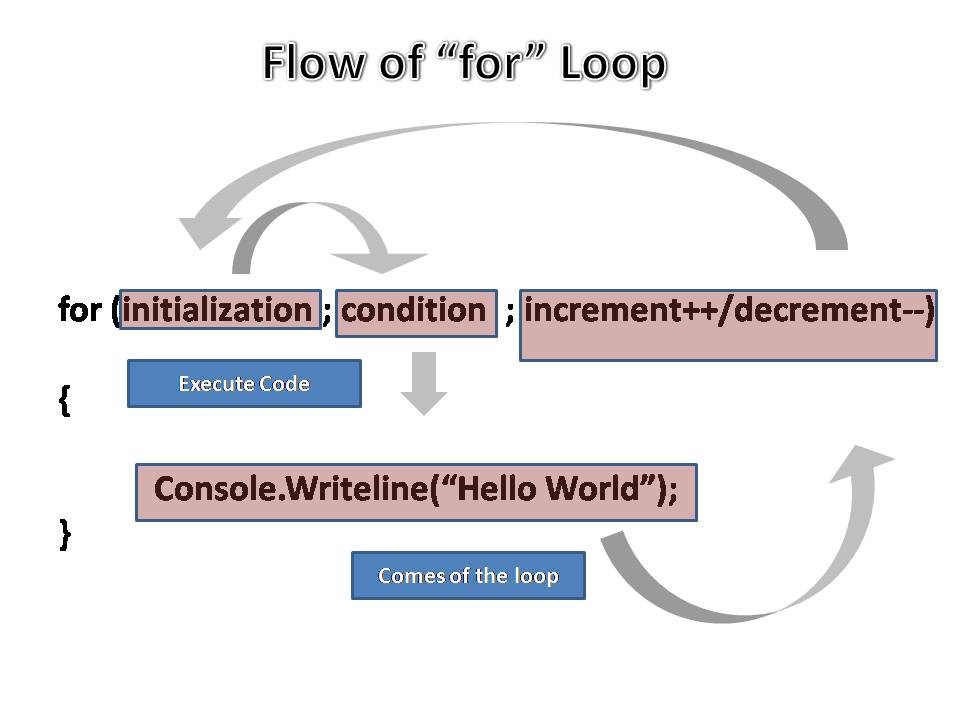

# For Loops

`for` loops are used to iterate a specific number of times. Perhaps a specific
number of times (maybe `5`), or once for each item in your data (each character
in a string, or each entry in an array).

[](https://www.freecodecamp.org/news/exploring-javascript-for-in-loops-bdfc226d8515/)

---

## Anatomy of a for loop

How are
[the three parts of for loop](https://developer.mozilla.org/en-US/docs/Web/JavaScript/Reference/statements/for)
conventionally used?

```js
for (initialization; condition; finalExpression) {
	// ... loop body ...
}
```

1. declare a variable, update the variable, check a condition.
2. declare a variable, check a condition, update the variable.
3. check a condition, update the variable, declare a variable.
4. check a condition, declare a variable, update the variable.

<details>
<summary>explanation</summary>
<br>

The correct answer is `2`:

- **declare a variable**: What needs to be initialized before the loop?
- **check a condition**: What condition must be true for the loop to repeat?
- **update the variable**: What will change so that the loop eventually ends?

```js
for (
	// 2: declare and assign the `step` variable
	let step = 0; // initialization
	// 3, 6, 9, 12: check if `step` is less than 3
	step < 3; // condition
	// 5, 8, 11: add 1 to `step`
	step++ // finalExpression
) {
	// 4, 7, 10: log the current value of `step`
	console.log(step);
}
```

<!-- questions from: https://runestone.academy/runestone/books/published/py4e-int/iterations/pogil.html -->

</details>
<br>

### `while` to `for`

Another good way to understand how `for` loops work is to compare them to a
while loop that increments a stepper variable.

Notice how `stepWhile` and `stepFor` are scoped differently in your debugger or
Js Tutor. `stepWhile` is available to the entire script, `stepFor` is only
available inside the for loop:

```js
// these two loops will take the same steps
//  which do you find easier to read?
//  do both loops' `step` variables have the same scope?

let max = 3;

// initialization
let step = 0;
// condition
while (step < max) {
	console.log(step);
	// final expression
	step = step + 1;
}

// initialization; condition; finalExpression
for (let step = 0; step < max; step++) {
	console.log(step);
}
```

There is one important difference! `step` in the `for` loop is _block scoped_,
trying to access it outside the loop will throw an error (hint: try the
_variables_ button):

```js
for (let step = 0; step < 3; step++) {
	console.log(step);
}

step; // ReferenceError
```

[TOP](for-loops)

---

## Use Cases

### Stepping Up

Stepper Variables change systematically, going through a series of values to
manage control flow. "Stepper" describes how you are using a variable. This term
is not a JavaScript thing, it's a general programming concept.

Using a stepper variable in a loop is such a common use case that the `for` loop
was designed to make it part of the language.

```js
'use strict';

const toRepeat = 'howdy';

let totalRepetitions = 4;

let repeatedString = '';

for (let i = 0; i < totalRepetitions; i++) {
	repeatedString += toRepeat;
	console.log('repeatedString:', repeatedString);
}

console.assert(
	repeatedString === 'howdyhowdyhowdyhowdy',
	'"howdy" should be repeated 4 times',
);
```

---

## Exercises

<details>
<summary>reverse a string</summary>

```js
// reverse a string

let originalString = 'jklm';
console.log('originalString:', originalString);

let reversedString = '';
console.log('reversedString:', reversedString);

for (_; _; _) {
	let nextLetter = _;
	reversedString = _ + _;
	console.log('reversedString:', reversedString);
}

console.assert(
	reversedString === 'mlkj',
	'reversed string is the original reversed',
);
```

</details>
<br>

[TOP](for-loops)

---

## References

- [Samir!](https://www.youtube.com/watch?v=fz2Uvf1ui-M)
- [programiz](https://www.programiz.com/javascript/for-loop)
- [HYF](https://hackyourfuture.github.io/study/#/javascript/loops?id=for)
- [javascript.info](https://javascript.info/while-for#the-for-loop)
- [MDN](https://developer.mozilla.org/en-US/docs/Web/JavaScript/Reference/Statements/for)
